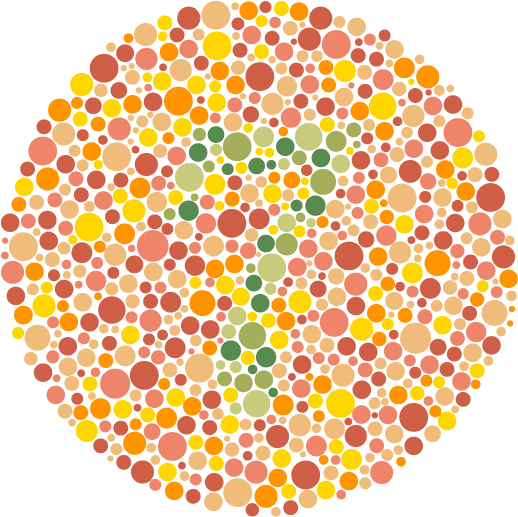

## deuteranopia

[](https://greenkeeper.io/)



Simulate the prevalent deuteranopia form of colorblindness.

### example

```js
var deuteranopia = require('deuteranopia');

             // rgb
deuteranopia(0, 200, 200);
```

### api

* `deuteranopia(r, g, b)`
* `deuteranopia([r, g, b])`

Given a RGB triplet, return a RGB triplet that simulates the effect of
deuteranopia.

## Credits

Based heavily off of [Color Oracle](http://colororacle.org/), which is in
turn based off of [Digital Video Colourmaps for
Checking the Legibility of
Displays by Dichromats](http://vision.psychol.cam.ac.uk/jdmollon/papers/colourmaps.pdf)
